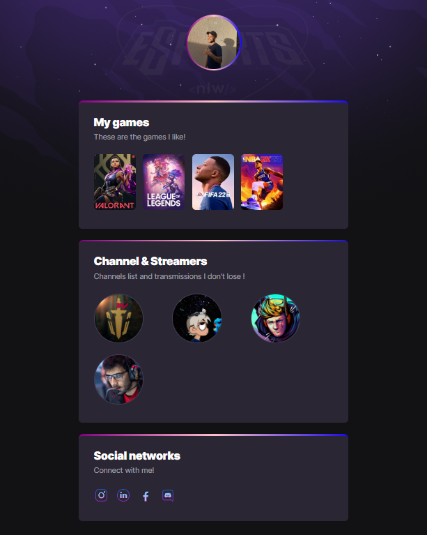

# NLW eSports -  

> Trilha Explorer

Projeto construído do evento Next Level Week da Rockseat.

[ 🔗 Clique aqui para acessar](https://VinnySoares12.github.io/NLW-eSports)

## ⚒️ Tecnologias 

- HTML
- CSS
- Git e Github

## O que aprendi:
 Aula 1
Base building: Aprendemos sobre o que é Front-end e Back-end e suas funcionalidades. Os três pilares da programação (algoritmos, lógica de programação e sintaxe).

Aula 2
High speed: Começamos a usar o Visual Studio Code, e dêmos, início ao projeto usando a Hipertext markup language(Linguagem de marcação de texto).

## 💛 contato

 Viniciusandreguidio@hotmail.com

